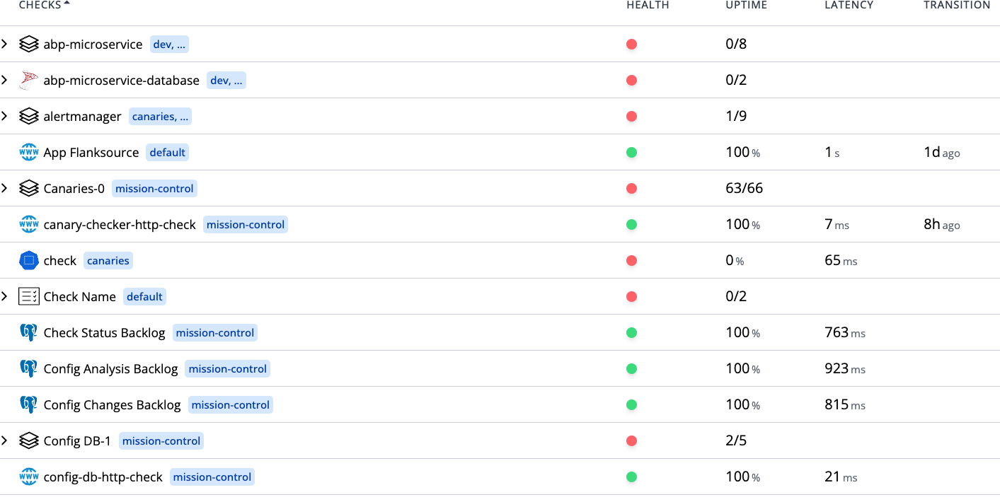

<Screenshot img="/img/health-checks.svg" size="900px" />

Canary Checker is a Kubernetes-native health check platform that periodically runs several types of tests:

1. Synthetic

   Synthetic checks test services and applications by generating requests using HTTP, SQL, MongoDB, Redis, LDAP, and other protocols.

1. Passive

   Passive checks consolidate alerts from monitoring systems like Prometheus, Datadog, Dynatrace, CloudWatch, and Elasticsearch.

1. Infrastructure

   Infrastructure checks verify Kubernetes resources, object storage, databases, and cloud APIs. Use Kubernetes Resource checks to create Kubernetes manifests and run checks against the created resources.

1. Integration

   Integration checks run automated test suites using tools like Playwright, JUnit, Newman, and k6 to validate end-to-end functionality across services and infrastructure.

### Metrics Exporter

In addition to returning a pass/fail status, health checks can export metrics to Prometheus, replacing the need for many custom Prometheus exporters.

### Scripting

Evaluate the health of checks using scripts in CEL, JavaScript, or Go Templating. Scripts can also filter and transform alerts from external systems.

## Dashboard

The health checks page provides a high-level view of the overall health of all services, infrastructure, and applications. It surfaces recent failures and provides high-level latency and reliability metrics.

## Prometheus

<CommonLink to="metrics">Prometheus</CommonLink> metrics are exposed from health checks to provide high-level visibility into latency, error rates, and other metrics. This allows monitoring the health of services and applications using existing Prometheus alerts and
<CommonLink to="grafana">Grafana</CommonLink> dashboards.

## Synthetic

Synthetic checks test services and applications by generating requests using HTTP, SQL, MongoDB, Redis, LDAP, and other protocols.
