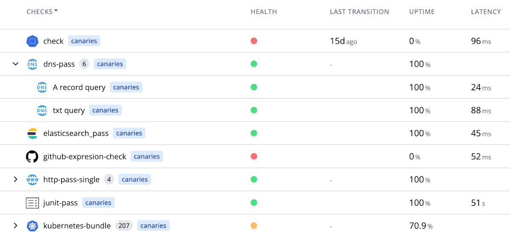

# Health Checks

Mission control provides the ability to define and run periodic health checks against services, infrastructure and applications.

<Step step={1} name="Synthetic" style="list">
Synthetic checks are periodically run by canary checker to directly test services/applications by generating requests using http, sql, mongo, redis, ldap, etc.

</Step>

<Step step={2} name="Passive " style="list">
Passive checks consolidate alerts from monitoring systems like Prometheus, Datadog, Dynatrace, CloudWatch and ElasticSearch
</Step>

<Step step={3} name="Infrastructure" style="list">
Active infrastructure checks provision infrastructure (e.g. EC2 Instances, Kubernetes Pods) and then run synthetic checks against them to verify the ability to provision infrastructure. This allows detecting issues in infrastructure provisioning processes.

</Step>

<Step step={3} name="Integration" style="list">
Integration checks run automated test suites using tools like Playwright, JUnit, Newman and K6 to validate end-to-end functionality across services and infrastructure.
</Step>

:::info
Under the hood health checks are implemented using the open-source [flanksource/canary-checker](https://github.com/flanksource/canary-checker) project
:::

### Metrics Exporter

In addition to returning a pass/fail status, health checks can export metrics to Prometheus, replacing the need for many custom prometheus exporters.

### Scripting

Evaluate the health of checks using scripts in CEL, Javascript or Go Templating. Scripts can also be used to filter and transform alerts from external systems.

