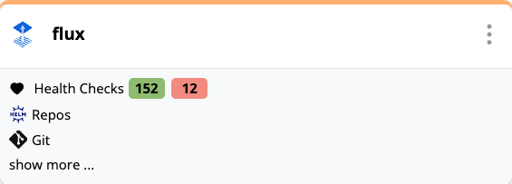

<Screenshot img="/img/health-checks.svg" size="900px" />

Mission control provides the ability to define and run periodic health checks against services, infrastructure, and applications.

1. **Synthetic** - checks  run periodically to directly test services/applications by generating requests using http, sql, mongo, redis, ldap, etc.
1. **Passive** checks consolidate alerts from monitoring systems like Prometheus, Datadog, Dynatrace, CloudWatch and ElasticSearch
1. **Infrastructure** checks provision infrastructure (e.g. EC2 Instances, Kubernetes Pods) and then run synthetic checks against them to verify the ability to provision infrastructure. This allows detecting issues in infrastructure provisioning processes.
1. **Integration** checks run automated test suites using tools like Playwright, JUnit, Newman and K6 to validate end-to-end functionality across services and infrastructure.

:::info
Under the hood health checks are implemented using the open-source [flanksource/canary-checker](https://github.com/flanksource/canary-checker) project
:::

### Metrics Exporter

In addition to returning a pass/fail status, health checks can export metrics to Prometheus, replacing the need for many custom prometheus exporters.

### Scripting

Evaluate the health of checks using scripts in CEL, Javascript or Go Templating. Scripts can also be used to filter and transform alerts from external systems.

 ### Dashboard
The health checks page provides a high level view of the overall health of all services, infrastructure, and applications. It surfaces recent failures and provides a high level latency and reliability metrics.

### Topology

Health checks can be associated with components in a [topology](topology/concepts/health-checks) and then show up in the topology card:

### Prometheus

[Prometheus](canary-checker/concepts/metrics) metrics are exposed from health checks to provide high level visibility into latency, error rates and other metrics. This allows monitoring the health of services and applications using existing Prometheus alerts and [Grafana](canary-checker/concepts/metrics/grafana) dashboards.

### Synthetic

Synthetic checks are periodically run by canary checker to directly test services/applications by generating requests using http, sql, mongo, redis, ldap, etc.

