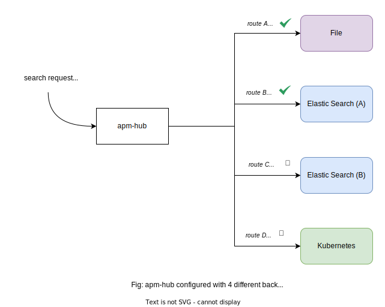

`apm-hub` can possibly serve hundreds of backends but you might not want all of them to serve a request. Routing helps you to control which backends should serve a given request based on the parameters shown below.



## Route

| Field      | Description                                                                                  | Scheme              | Required   |
| ---------- | -------------------------------------------------------------------------------------------- | ------------------- | ---------- |
| `type`     | Serve queries if the `type` matches this value.                                              | `string`            | `optional` |
| `idPrefix` | Serve queries if the `id` has this prefix.                                                   | `string`            | `optional` |
| `labels`   | Serve queries matching these labels.                                                         | `map[string]string` | `true`     |
| `additive` | Specifies whether this backend should return results exclusively.<br>_(Defaults to `false`)_ | `bool`              | `optional` |

Every backend should have at least one route defined. If multiple routes are defined, then the backend will be used if any of the routes match the query.

## Wildcard

If you need a backend to serve all the requests, you have the option to specify a wildcard route. A route with an empty value for idPrefix indicates a wildcard route.

```yaml
backends:
  - kubernetes:
      routes:
        - idPrefix: ''
```

## Labels matching

Labels are a set of key value pairs that are compared against the labels in the [search request](./api.md#search-param). If the labels in the route match the labels in the search request, then the backend will be used.

```yaml
backends:
  - kubernetes:
      routes:
        - labels:
            app: my-app
            env: prod
```

For the configuration above, the kubernetes backend will be used if the search request contained those labels.

### Wildcard labels

If you don't really care the value of the label but need the label to be there, you can use a wildcard label.

```yaml
backends:
  - kubernetes:
      routes:
        - labels:
            app: *
            env: prod
```

### Blacklisting labels

You can also blacklist labels by using a `!` prefix.

```yaml
backends:
  - kubernetes:
      routes:
        - labels:
            app: !frontend
            env: prod
```

### Set of values

You can provide a set of values for a label by using a comma separated list.

```yaml
backends:
  - kubernetes:
      routes:
        - labels:
            app: !frontend
            env: dev,stage
```

## Additive routes

As you can imagine, a single search query can possibly be served by numerous backends. A non-additive route enables a backend to return the results exclusively. This means that if a backend is configured with a non-additive route, then it will discard all the results from other backends collected so far and return only its results. Once a non-additive route is matched, the search will stop and the results will be returned.

!!! info

    All routes are non-additive by default.



````yaml

```yaml
backends:
  - kubernetes:
      routes:
        - additive: true
          labels:
            app: !frontend
            env: dev,stage
````
