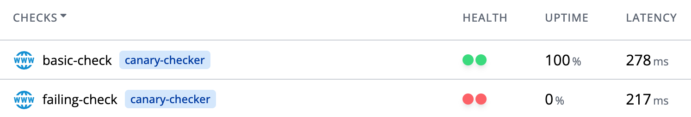

---
hide:
  - toc
---


Canary checker is a kubernetes-native platform for monitoring health across application and infrastructure using both passive and active (synthetic) mechanisms.

## Features

* **Batteries Included** - 35+ built-in check types
* **Kubernetes Native** - Health checks (or canaries) are CRD's that reflect health via the `status` field, making them compatible with GitOps, [Flux Health Checks](https://fluxcd.io/flux/components/kustomize/kustomization/#health-checks), Argo, Helm, etc..
* **Secret Management** - Leverage K8S secrets and configmaps for authentication and connection details
* **Prometheus** - Prometheus compatible metrics are exposed at `/metrics`.  A Grafana Dashboard is also available.
* **Dependency Free** - Runs an embedded postgres instance by default,  can also be configured to use an external database.
* **JUnit Export (CI/CD)**  - Export health check results to JUnit format for integration into CI/CD pipelines
* **JUnit Import (k6/newman/puppeter/etc)** - Use any container that creates JUnit test results
* **Scriptable** - Go templates, Javascript and [Expr](https://github.com/antonmedv/expr) can be used to:
  * Evaluate whether a check is passing and severity to use when failing
  * Extract a user friendly error message
  * Transform and filter check responses into individual check results
* **Multi-Modal** - While designed as a Kubernetes Operator, canary checker can also run as a CLI and a server without K8s

## Use Cases

* **Synthetic Monitoring**

* **Unified Alerting**

## Getting Started

1. Install canary checker:

  ```shell
  helm repo add flanksource https://flanksource.github.io/charts
  helm repo update
  helm install canary-checker
  ```

2. Create a new check:

  ```yaml title="canary.yaml"
  apiVersion: canaries.flanksource.com/v1
  kind: Canary
  metadata:
    name: http-check
  spec:
    interval: 30
    http:
      - name: basic-check
        url: https://httpbin.demo.aws.flanksource.com/status/200
      - name: failing-check
        url: https://httpbin.demo.aws.flanksource.com/status/500
  ```

2a. Run the check locally (Optional)

```shell
canary-checker run canary.yaml
```

[](https://asciinema.org/a/cYS6hlmX516JQeECHH7za3IDG)

```shell
kubectl apply -f canary.yaml
```

3. Check the status of the health check:

```shell
kubectl get canary
```

[](https://asciinema.org/a/tXluDS5sH68gVdko4qctIZEC1)

4. Check the Dashboard



## Getting Help

If you have any questions about canary checker:

* Read the  [docs](https://canarychecker.io)
* Invite yourself to the [CNCF community slack](https://slack.cncf.io/)and join the [#canary-checker](https://cloud-native.slack.com/messages/canary-checker/) channel.
* Check out the [Youtube Playlist](https://www.youtube.com/playlist?list=PLz4F_KggvA58D6krlw433TNr8qMbu1aIU).
* File an [issue](https://github.com/flanksource/canary-checker/issues/new) - (We do provide user support via Github Issues, so don't worry  if your issue a real bug or not)

Your feedback is always welcome!

## License

Canary Checker core (the code in this repository) is licensed under [Apache 2.0](https://raw.githubusercontent.com/flanksource/canary-checker/main/LICENSE) and accepts contributions via GitHub pull requests after signing a CLA.

The UI (Dashboard) is free to use with canary checker under a license exception of [Flanksource UI](https://github.com/flanksource/flanksource-ui/blob/main/LICENSE#L7)

## Check Types

| Protocol                            | Status             | Checks |
| ----------------------------------- | ------------------ | ---- |
| [HTTP(s)](../reference/http)                             | GA                 | Response body, headers and duration |
| [DNS](../reference/dns)                                 | GA                 | Response and duration |
| [Ping/ICMP](../reference/icmp)                            | GA | Duration and packet loss |
| [TCP](../reference/tcp) | GA | Port is open and connectable |
| **Data Sources**                    |                    |      |
| SQL ([MySQL](../reference/mysql), [Postgres](../reference/postgres), [SQL Server](../reference/mssql)) | GA | Ability to login, results, duration, health exposed via stored procedures |
| [LDAP](../reference/ldap)                                | GA | Ability to login, response time |
| [ElasticSearch / Opensearch](../reference/elasticsearch)           | GA | Ability to login, response time, size of search results |
| [Mongo](../reference/mongo)                               | Beta | Ability to login, results, duration, |
| [Redis](../reference/redis)                               | GA | Ability to login, results, duration, |
| [Prometheus](../reference/prometheus) | GA | Ability to login, results, duration, |
| **Alerts**                 |                    | Prometheus |
| [Prometheus Alert Manager](../reference/alert-manager) | GA | Pending and firing alerts |
| [AWS Cloudwatch Alarms](../reference/cloudwatch) | GA | Pending and firing alarms |
| [Dynatrace Problems](./reference/dynatrace.md) | Beta | Problems deteced |
| **DevOps** |  |  |
| [Git](../reference/git) | GA | Query Git and Github repositories via SQL |
| [Azure Devops](../reference) |  |  |
| **Integration Testing** |  |  |
| [JMeter](../reference/jmeter) | Beta | Runs and checks the result of a JMeter test |
| [JUnit / BYO](../reference/junit) | Beta | Run a pod that saves Junit test results |
| **File Systems / Batch** |                    |      |
| [Local Disk / NFS](../reference/folder)                      | GA         | Check folders for files that are:  too few/many, too old/new, too small/large |
| [S3](../reference/s3-bucket) | GA | Check contents of AWS S3 Buckets |
| [GCS](../reference/gcs-bucket) | GA | Check contents of Google Cloud Storage Buckets |
| [SFTP](../reference/sftp) | GA | Check contents of folders over SFTP |
| [SMB / CIFS](../smb) | GA | Check contents of folders over SMB/CIFS |
| **Config**                          |                    |      |
| [AWS Config](../reference/aws-config)                          | GA | Query AWS config using SQL |
| [AWS Config Rule](../reference/aws-config-rule)                          | GA | AWS Config Rules that are firing, Custom AWS Config queries |
| [Config DB](../reference/configdb)             | GA | Custom config queries for Mission Control Config D |
| [Kubernetes Resources](../reference/kubernetes)                | GA | Kubernetes resources that are missing or are in a non-ready state |
| **Backups**                         |                    |      |
| [GCP Databases](..refere)  | GA | Backup freshness |
| [Restic](../reference/restic)                              | Beta | Backup freshness and integrity |
| **Infrastructure** |  | |
| [EC2](../reference/ec2) | GA | Ability to launch new EC2 instances |
| [Kubernetes Ingress](../reference/pod) | GA | Ability to schedule and then route traffic via an ingress to a pod |
| [Docker/Containerd](../reference/containerd) | Deprecated | Ability to push and pull containers via docker/containerd |
| [Helm](../reference/helm) | Deprecated | Ability to push and pull helm charts |
| [S3 Protocol](../reference/s3-protocol) | GA | Ability to read/write/list objects on an S3 compatible object store |
