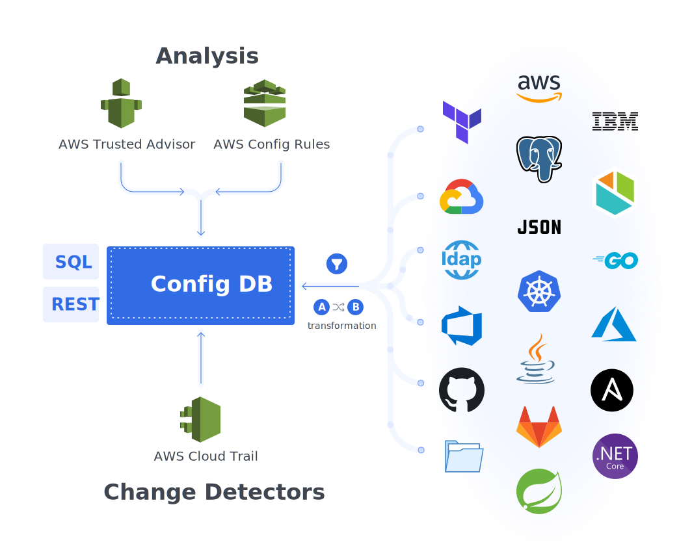

`Config DB` is a straightforward JSON-based configuration management database. It enables you to scrape configuration from several sources on an ongoing basis and navigate that configuration in an easy-to-navigate and search JSON tree.

By doing this, `Config DB` enables you to view and search the change history of your configuration across multiple dimensions _(node, zone, environment, application, technology, etc...)_ as well as compare and view the differences between configurations across environments.

It is able to scan multiple configuration sources including

- [AWS Cloud Resources](./scrapers/aws.md)
- [Azure Devops](./scrapers/azure-devops.md) - Azure Devops Pipeline runs
- [Files](./scrapers/file.md) - On a local filesystem, git or HTTP
- [Files - Kubernetes](./scrapers/kubernetes-file.md) - Files inside a running Kubernetes pod
- [Kubernetes](./scrapers/kubernetes.md) - Kubernetes resources
- [SQL](./scrapers/sql.md) - Data available via queries on MySQL, SQL Server, and Postgres databases

Each configuration has:

- Configuration - Normally JSON, but XML and properties files are also available
- Insights - Security, cost, performance, and other recommendations from scanners including AWS Trusted Advisor, AWS Config rules, etc...
- Changes - Either change directly on the config _(recorded as diff change type)_ or changes identified via AWS Cloudtrail, etc...
