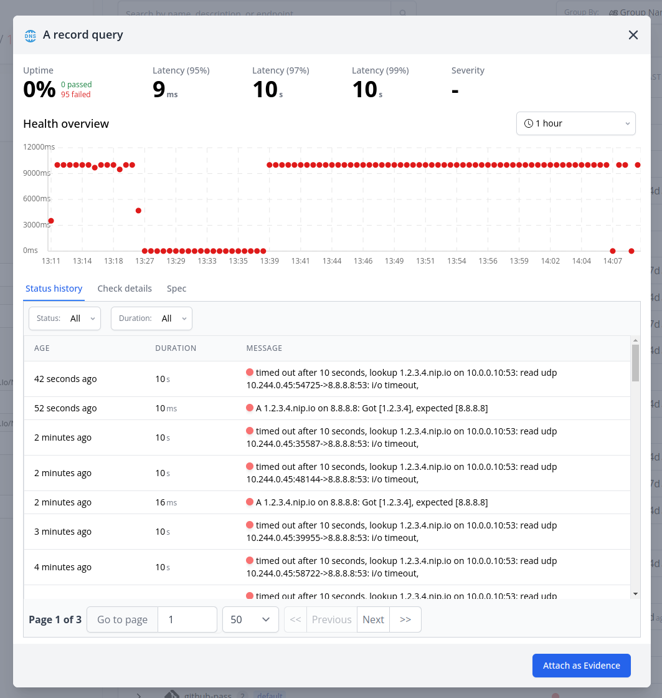

# Evidence

Evidence plays a critical role in understanding and resolving incidents. Evidence can consist of anything that supports or refutes a hypothesis, including logs, health checks, configs, and more. This documentation will guide you on how to add, manage, and use evidence within the Incident Management system.

## Types of evidence

### A. Topology

### B. Config Items

### C. Config Changes

### D. Config Analysis

### E. Health Checks

### F. Logs

