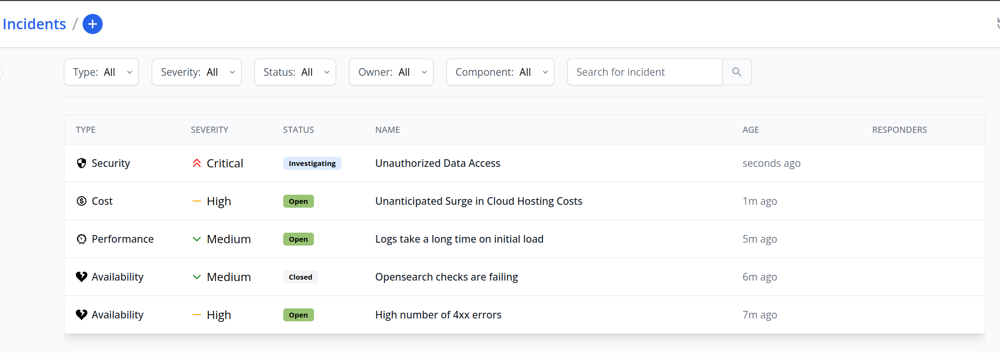

# Incidents

Any event capable of causing a disruption in your organization's workflow qualifies as an incident. It's crucial to establish a methodical procedure for managing such events. Our incident management feature serves as a strategic solution for your organization to efficiently identify and resolve incidents.

Incidents are integrated within the Flanksource system, side by side with the configs & health checks. This allows for a comprehensive view and effective filtering of incidents relevant to your situation.
