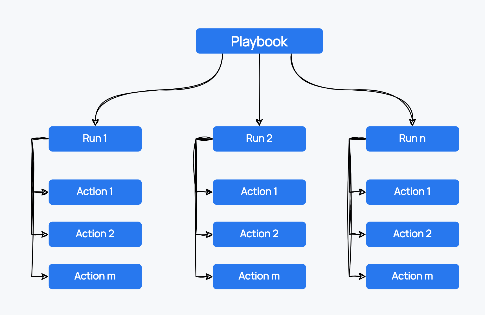

A Playbook is a configurable automated process that can run one or more actions for a component, check or a config item. It is a streamlined way to orchestrate tasks. The foundation of playbooks lies in YAML files, where you outline the specifications for each playbook. Once defined, these playbooks are executed as runs, encapsulating a series of actions.

