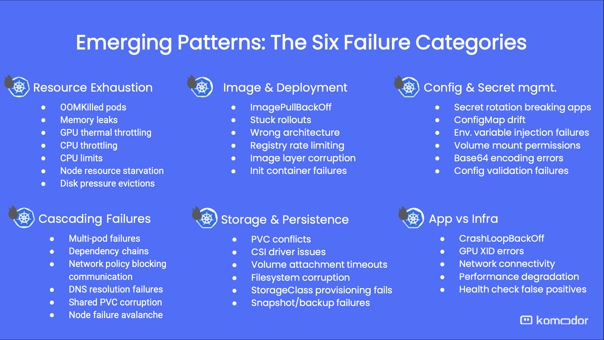

A Kubernetes cluster can run its existing workloads successfully but fail to provision new ones.
Existing Pods may be running and monitoring dashboards may be green, but those signals describe
only workloads that are already in place. They do not verify that admission, scheduling, image
pulls, configuration, networking, and storage will succeed for a new Pod. The next rollout,
scale-up, or node replacement may be the first event to expose a broken provisioning path.

<!--truncate-->

## Common Kubernetes failure patterns

In a
[presentation at SCALE 23x](https://www.socallinuxexpo.org/scale/23x/presentations/why-your-kubernetes-cluster-will-fail-lessons-1-million-real-world),
[Komodor](https://komodor.com/) grouped common Kubernetes failures into six patterns.
They claim to have analyzed more than a million production Kubernetes incidents across
thousands of clusters.



- **Resource exhaustion:** Pods run out of memory, workloads consume more resources over time,
  or the cluster lacks capacity for new workloads.
- **Image and deployment issues:** Kubernetes cannot pull an image or complete a rollout.
- **Configuration and secret management:** Configuration drifts or a secret rotation breaks an
  application.
- **Cascading failures:** One missing resource or unavailable dependency causes failures in
  multiple workloads.
- **Storage and persistence:** Claims conflict or the Container Storage Interface (CSI) driver
  cannot provision or attach a volume.
- **Application and infrastructure failures:** Similar symptoms, such as a `CrashLoopBackOff`,
  can originate in the application or its underlying infrastructure.

## Why common failures go unnoticed

These failures do not always interrupt workloads that are already running. Some affect paths
that Kubernetes uses only when it creates or replaces a workload. Until that happens, workload
and endpoint monitoring can continue to report that everything is healthy.

### A new admission policy rejects the next Pod

A platform team might add a validating admission policy that rejects new Pods unless
`securityContext.runAsNonRoot` is set to `true`. Policy engines such as
[Kyverno](https://kyverno.io/) and
[OPA Gatekeeper](https://open-policy-agent.github.io/gatekeeper/website/) can enforce these
policies when Kubernetes admits a resource. Existing Pods continue running because Kubernetes
does not send them through admission again.

These tools can audit existing resources and report policy violations, but they do not remove
the existing Pods. If those audit results are not monitored, the incompatibility remains hidden
until a rollout tries to create replacement Pods from the same configuration.

### The registry is unavailable to a new node

A running container does not need continued access to the registry that supplied its image. The
registry credentials can expire, or registry DNS and network access can fail, without affecting
the container.

The failure can remain hidden for longer when a workload uses `imagePullPolicy: IfNotPresent`.
Replacement Pods may start on nodes that already have the image, while the first Pod scheduled
to a new or uncached node fails with `ImagePullBackOff`.

### Existing volumes hide a provisioning failure

Running workloads use volumes that have already been provisioned, attached, and mounted. A
failure in a CSI controller, exhausted storage quota, or lost access to the storage provider can
prevent new volumes from being created without disrupting volumes that are already in use.

The problem appears when a new workload creates a PersistentVolumeClaim. That request invokes
the StorageClass provisioner, and the workload cannot start if
[dynamic volume provisioning](https://kubernetes.io/docs/concepts/storage/dynamic-provisioning/)
fails.

Each case has the same blind spot: existing workloads show that provisioning succeeded before.
They do not prove that the cluster can repeat it now. Detecting these failures requires the
cluster to exercise its provisioning paths regularly.

## Detect hidden failures with Kubernetes Resource checks

The approach is deliberately simple. Canary Checker provisions a representative workload on a
schedule and verifies that it works. It does not try to infer whether the provisioning path is
healthy; it exercises the path directly. The most reliable way to find out whether Kubernetes
can provision the next workload is to ask it to do so:

> Can the cluster create and exercise the resources that the next change needs?

Canary Checker's [`kubernetesResource`](https://canarychecker.io/reference/kubernetes-resource)
turns that question into a repeatable transaction. A check can combine long-lived test
dependencies with disposable resources. On each run, Canary Checker applies both sets, waits
for the state you define, and then deletes the disposable resources while preserving the
long-lived dependencies for the next run.

A minimal check can preserve a Namespace between runs while creating a fresh Pod inside it:

```yaml title="namespace-and-pod.yaml"
apiVersion: canaries.flanksource.com/v1
kind: Canary
metadata:
  name: namespace-and-pod
spec:
  schedule: '@every 5m'
  kubernetesResource:
    - name: create-pod
      clearResources: true
      staticResources:
        - apiVersion: v1
          kind: Namespace
          metadata:
            name: platform-tests
      resources:
        - apiVersion: v1
          kind: Pod
          metadata:
            name: test-pod
            namespace: platform-tests
          spec:
            containers:
              - name: web
                image: nginx:1.27.4-alpine
      waitFor:
        timeout: 2m
        delete: true
```

Canary Checker applies the Namespace on every run but does not remove it afterward. It creates
the Pod, waits for it to become ready, and then deletes it.

The Kubernetes Resource check follows this lifecycle:

1. It applies every manifest in `staticResources`. Applying them on each run creates missing
   resources and reconciles existing ones.
2. If `clearResources` is enabled, it removes disposable resources left by an interrupted run.
   It then applies every manifest in `resources`.
3. It polls both sets of resources until the default readiness test or your `waitFor` expression
   passes.
4. It deletes the resources under `resources`, even when readiness fails.

Canary Checker preserves `staticResources` until you delete the Canary. A `Namespace`,
`ServiceAccount`, `RoleBinding`, `Ingress`, or `HelmRepository` can be static when disposable
test workloads depend on it. The distinction depends on what you want to test: keep a Namespace
static when it contains each run's resources, but put it under `resources` when the check needs
to verify Namespace creation itself.

## Test three failure patterns with one check

One Kubernetes Resource check can cover more than one failure category. The following example
focuses on three: image and deployment issues, configuration and secret management, and storage
and persistence.

It creates a ConfigMap, Secret, PersistentVolumeClaim, and Pod in the static Namespace from the
previous example. On each run, the kubelet contacts the image registry and mounts the
configuration, secret, and volume into the new Pod.

```yaml title="three-failure-patterns.yaml"
apiVersion: canaries.flanksource.com/v1
kind: Canary
metadata:
  name: three-failure-patterns
spec:
  schedule: '@every 1h'
  kubernetesResource:
    - name: provision-representative-pod
      clearResources: true
      staticResources:
        - apiVersion: v1
          kind: Namespace
          metadata:
            name: platform-tests
      resources:
        - apiVersion: v1
          kind: ConfigMap
          metadata:
            name: test-config
            namespace: platform-tests
          data:
            mode: synthetic
        - apiVersion: v1
          kind: Secret
          metadata:
            name: test-secret
            namespace: platform-tests
          type: Opaque
          stringData:
            token: synthetic-token
        - apiVersion: v1
          kind: PersistentVolumeClaim
          metadata:
            name: test-storage
            namespace: platform-tests
          spec:
            accessModes: [ReadWriteOnce]
            storageClassName: standard
            resources:
              requests:
                storage: 1Gi
        - apiVersion: v1
          kind: Pod
          metadata:
            name: representative-workload
            namespace: platform-tests
          spec:
            containers:
              - name: workload
                image: busybox:1.36.1
                imagePullPolicy: Always
                command: ['sleep', '3600']
                volumeMounts:
                  - name: config
                    mountPath: /etc/test-config
                    readOnly: true
                  - name: secret
                    mountPath: /etc/test-secret
                    readOnly: true
                  - name: data
                    mountPath: /data
            volumes:
              - name: config
                configMap:
                  name: test-config
              - name: secret
                secret:
                  secretName: test-secret
              - name: data
                persistentVolumeClaim:
                  claimName: test-storage
      waitFor:
        timeout: 5m
        delete: true
```

This one transaction exercises three failure categories:

| Failure category | What the transaction exercises |
| --- | --- |
| Image and deployment | The kubelet contacts the registry, resolves the image, downloads any uncached layers, and starts the container. |
| Configuration and secret management | Kubernetes creates the ConfigMap and Secret, and the kubelet mounts both into a new Pod. |
| Storage and persistence | The CSI provisioner creates a volume for the StorageClass, Kubernetes attaches it, and the kubelet mounts it into the Pod. |

The transaction does not repair a registry, configuration path, or storage provisioner. It
exposes a failure before a production rollout depends on the same path.

_The example uses the `standard` StorageClass and creates a potentially billable volume. Replace
it with the StorageClass used by your workload, choose the smallest supported volume, and confirm
that the storage provider deletes the volume after the check finishes._

Readiness proves that Kubernetes created the resources and started a Pod with the declared
mounts. It does not prove that an application can interpret the configuration, read and write
data correctly, or serve traffic. Those behaviors require additional checks.

## Verify behavior with additional checks

The `checks` field runs other Canary Checker checks after the resources satisfy `waitFor`.
The following example creates an NGINX Pod and Service, then uses an HTTP check to call the
Service:

```yaml title="nginx-service.yaml"
apiVersion: canaries.flanksource.com/v1
kind: Canary
metadata:
  name: nginx-service
  namespace: platform-tests
spec:
  schedule: '@every 5m'
  kubernetesResource:
    - name: create-and-call-nginx
      clearResources: true
      resources:
        - apiVersion: v1
          kind: Pod
          metadata:
            name: nginx
            labels:
              app: nginx
          spec:
            containers:
              - name: nginx
                image: nginx:1.27.4-alpine
                ports:
                  - name: http
                    containerPort: 80
        - apiVersion: v1
          kind: Service
          metadata:
            name: nginx
          spec:
            selector:
              app: nginx
            ports:
              - name: http
                port: 80
                targetPort: http
      waitFor:
        timeout: 2m
        delete: true
      checks:
        - http:
            - name: call-nginx
              url: http://nginx.platform-tests.svc/
              responseCodes: [200]
```

`waitFor` confirms that Kubernetes created the Pod and Service and that they report ready. The
HTTP check confirms that Canary Checker can resolve the Service and receive a response from
NGINX. If readiness passes but the HTTP check fails, start with Service selection, EndpointSlices,
DNS, or network routing.

---

Running Pods show that Kubernetes provisioned a workload successfully in the past. A scheduled
Kubernetes Resource check provides evidence that the same paths still work now. Start with one
representative transaction and verify the behavior that matters.
[Install Canary Checker](https://canarychecker.io/installation/) or review the
[`kubernetesResource` reference](https://canarychecker.io/reference/kubernetes-resource) to test
the paths that your next rollout depends on.
