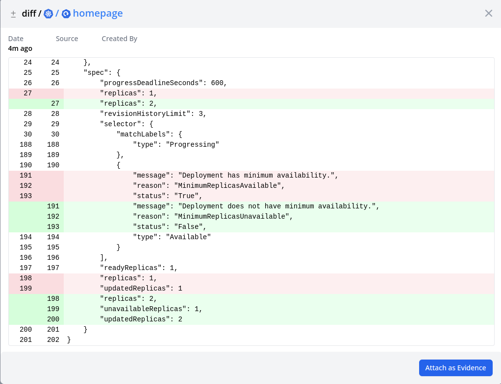

# Changes

Once a config item has been saved to ConfigDB, it's changes are also tracked. The changes could come from external sources like Kubernetes events, Azure activities, ... Or the changes can be auto detected by comparing the old config with the newly changed config.

_Fig: Kubernetes Deployment Replica change tracking_
