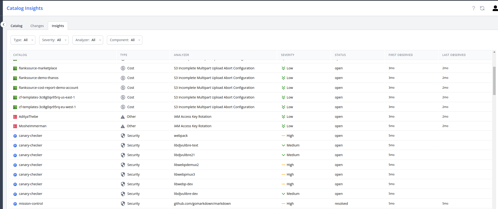

# Insights

Some scrapers have the ability to tap into an advisor source that provides insights about a config.

_Fig: Config insights_

## Scrapers

| Scraper    | Insight Provider    |
| ---------- | ------------------- |
| Kubernetes | Trivy               |
| AWS        | AWS Trusted Advisor |
| Azure      | Azure Advisor       |
