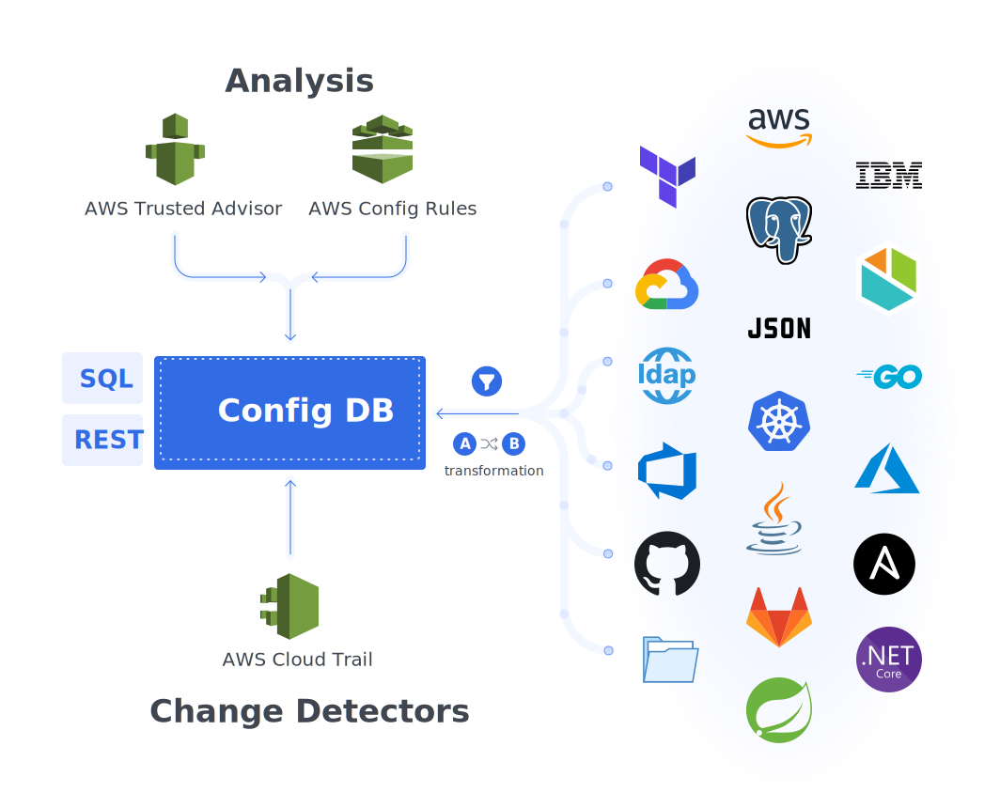

# Overview

**Catalog** enhances configuration management by providing a clear view and search function for tracking changes across various dimensions such as nodes, zones, environments, applications, and technologies. This utility is enabled by a JSON-based database that regularly collects configuration data from multiple sources. The data is organized into a searchable JSON tree, facilitating efficient comparison and analysis across different environments.

A configuration summary is shown below:

Each configuration has:

- **Configuration** - Normally JSON, but XML and properties files are also available
- **Insights** - Security, cost, performance, and other recommendations from scanners including AWS Trusted Advisor, AWS Config rules, etc.
- **Changes** - Either change directly on the config _(recorded as diff change type)_ or changes identified via AWS Cloudtrail, etc.

You can scan multiple configuration sources including:

- [AWS Cloud Resources](./scrapers/aws.md)
- [Azure Devops](./scrapers/azure-devops.md) - Azure Devops Pipeline runs
- [Files](./scrapers/file.md) - On a local filesystem, git or HTTP
- [Files - Kubernetes](./scrapers/kubernetes-file.md) - Files inside a running Kubernetes pod
- [Kubernetes](./scrapers/kubernetes.md) - Kubernetes resources
- [SQL](./scrapers/sql.md) - Data available via queries on MySQL, SQL Server, and Postgres databases
- [Trivy](./scrapers/trivy.md) - Security scanning of Kubernetes clusters

