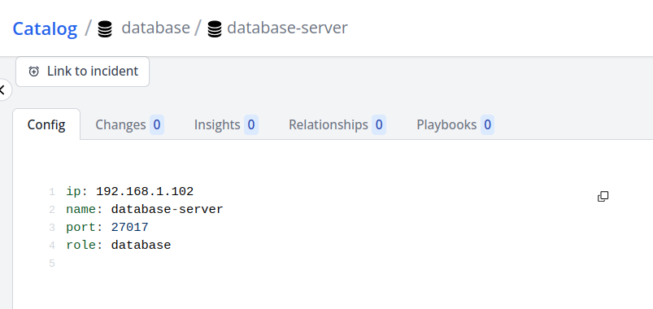
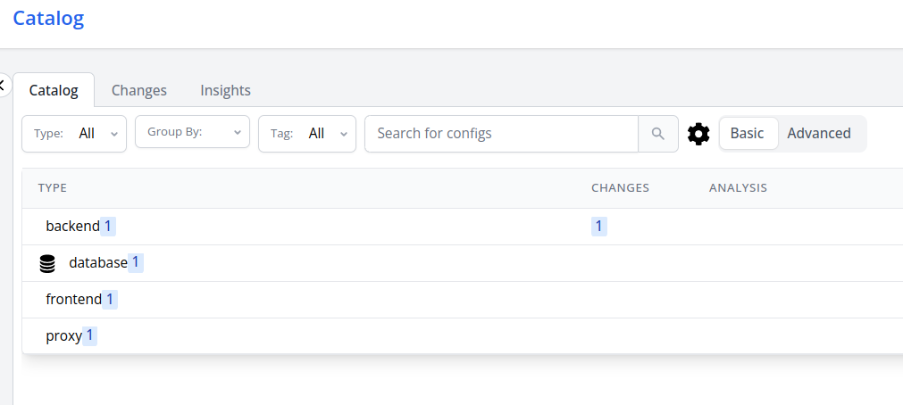

# Scraping Custom File

In this tutorial we'll scrape a custom JSON file and see how config-db monitors changes to it over time.

Let's start off by creating this example file that we want to scrape

```json title="vms.json"
{
  "servers": [
    {
      "name": "web-server",
      "ip": "192.168.1.100",
      "port": 80,
      "role": "frontend"
    },
    {
      "name": "api-server",
      "ip": "192.168.1.101",
      "port": 8080,
      "role": "backend"
    },
    {
      "name": "database-server",
      "ip": "192.168.1.102",
      "port": 27017,
      "role": "database"
    }
  ],
  "logging": {
    "level": "info",
    "file_path": "/var/log/app.log"
  }
}
```

Place this file anywhere in your system and take note of its path. For the sake of simplicity, let's keep that file inside the `/tmp` dir.

## Goal

In the file above, we're mainly concerned with the servers. We want to have each of those servers as a config items.

## Designing the scaper

Each config item needs two mandatory fields

- id
- type

We need to tell config-db where it can get those for each of our servers.

We can utilize the IP address as the identifier since it is unique for our purposes, and designate the "role" attribute as the type.
We do this by specifying the fields using JSONPath.
Additionally, we're also going to specify the name of each config even though it's optional.

We can also supply hard coded values instead of a json path. Since all of these servers are virtual machines, let's specify the class as a static value "VritualMachine".

:::note
If the class wasn't specified, the type would have been used as a fallback.
:::

Now finally, we need to tell config-db how it can generate 3 different configs for each of those servers from one config file. We do that by using transformation scripts. In this example, we've used javascript but other scripting option are also available like - CEL Expression & Go Template.

```yaml title='vms-scraper.yaml'
apiVersion: configs.flanksource.com/v1
kind: ScrapeConfig
metadata:
  name: vm-scraper
  namespace: default
spec:
  schedule: '@every 30s'
  file:
    - type: $.role
      id: $.ip
      name: $.name
      class: VirtualMachine
      transform:
        javascript: JSON.stringify(config.servers)
      paths:
        - /tmp/vms.json
```

To summarize, this scraper will scraper our file `/tmp/vms.json` every 30 seconds and generate 3 config items for each of the servers. If more servers are added/removed in future, they'll be reflected in config-db.

## Run the scraper

Save the scraper and wait for it to run. You should see the job status go green.


You should now be able to see the 3 servers in Catalog.


The content of the config items should be exactly what we have in `/tmp/vms.json`.
They are represented as YAML but internally they are still saved as JSON.



## Adding a new item

In our `/tmp/vms.json`, let's add one more vm for a proxy server and see how config-db reacts to it.

```json title=vms.json
{
  "servers": [
    {
      "name": "web-server",
      "ip": "192.168.1.100",
      "port": 80,
      "role": "frontend"
    },
    {
      "name": "proxy-server",
      "ip": "192.168.1.103",
      "port": 443,
      "role": "proxy"
    },
    {
      "name": "api-server",
      "ip": "192.168.1.101",
      "port": 8080,
      "role": "backend"
    },
    {
      "name": "database-server",
      "ip": "192.168.1.102",
      "port": 27017,
      "role": "database"
    }
  ],
  "logging": {
    "level": "info",
    "file_path": "/var/log/app.log"
  }
}
```

You should see a new config item for the proxy server.

## Monitoring changes

Let's modify the port of our api-server from `8080` to `3000`. Wait for a few seconds until the change is picked up.

The catalog summary table now shows that there's 1 change in our api-server.


To see the details of the change, click on the config item.


## Deleting items

Remove the proxy-server that we added before. If you notice, it's not immediately removed by config-db. That is because config-db waits for a certain time before it deletes a config item that it doesn't see anymore. By default, the timeout is 30 minutes but it can be [configured on the scraper](../concepts/retention#cleaning-up-stale-configs). To see an immediate result, update the `staleItemAge` to 0.
