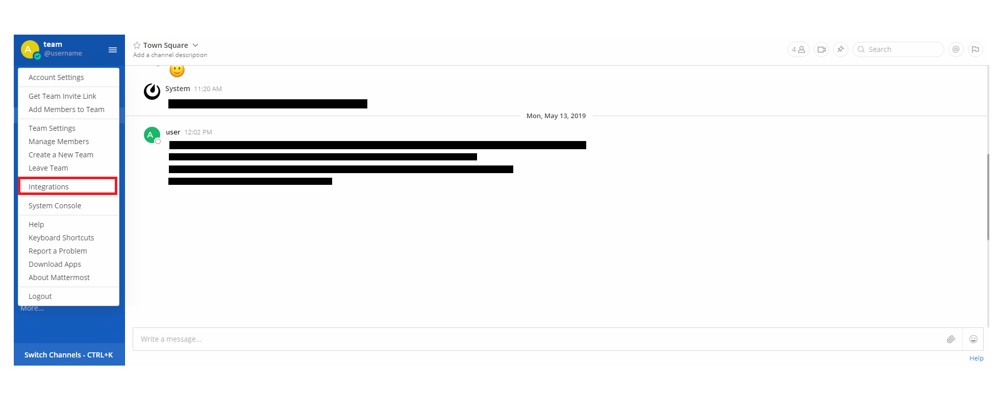
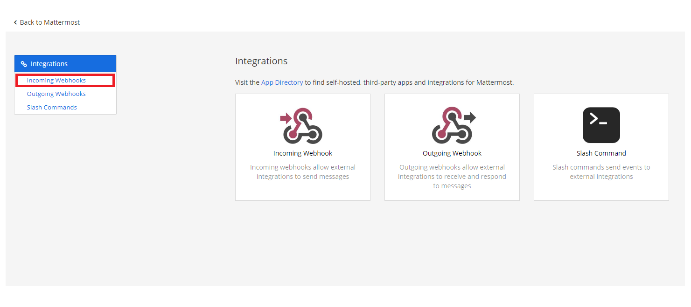
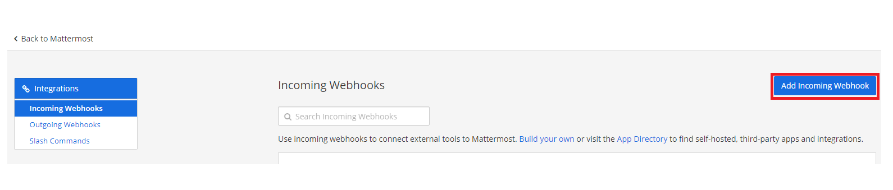
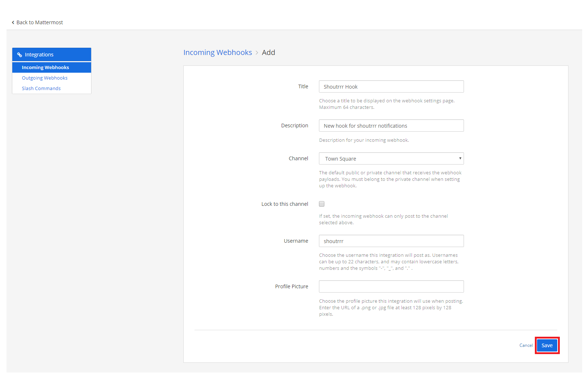
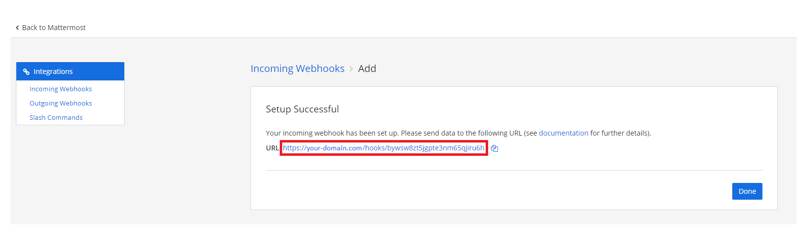

---
sidebar_custom_props:
  icon: mattermost
---


# MatterMost

:::info URL Format
    mattermost://[__`username`__@]__`mattermost-host`__/__`token`__[/__`channel`__][?icon=__`smiley`__]
:::


## Creating a Webhook in MatterMost

1. Open up the Integrations page by clicking on *Integrations* within the menu


2. Click *Incoming Webhooks*


3. Click *Add Incoming Webhook*


4. Fill in the information for the webhook and click *Save*


5. If you did everything correctly, MatterMost will give you the *URL* to your newly created webhook


6. Format the service URL
    ```
    https://your-domain.com/hooks/bywsw8zt5jgpte3nm65qjiru6h
                                └────────────────────────┘
                                            token
    mattermost://your-domain.com/bywsw8zt5jgpte3nm65qjiru6h
                                └────────────────────────┘
                                        token
    ```

