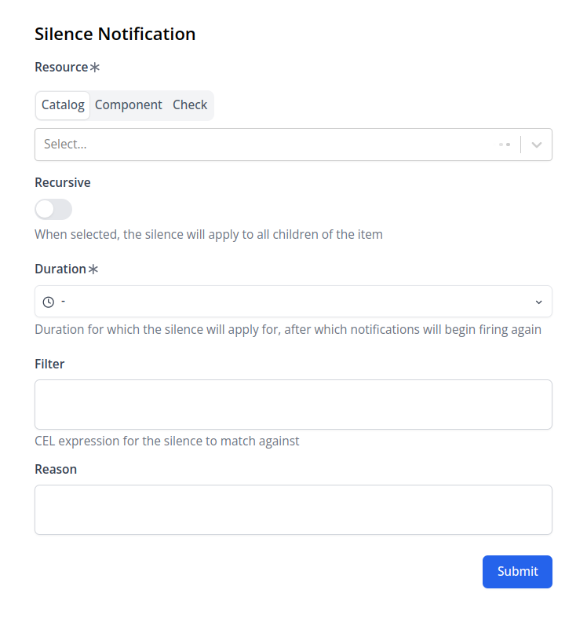

import Silence from "@site/docs/reference/notifications/_silence.mdx"

A silence is a way to temporarily suppress notifications. Each silence has:

- A description - explaining why the silence was created
- A duration - specified by `from` and `until` timestamps in RFC3339 format
- A scope - defined through selectors and filters to target specific resources
- A recursive flag - to apply silence to child resources

:::note
Notifications that aren't sent due to silence are still visible in the notification history for auditing purposes.
:::


```yaml title="" file=<rootDir>/modules/mission-control/fixtures/silences/silence-test-env.yaml
``` 

## Use cases

- Planned maintenance or deployments - Silence notifications from a namespace or helm release and optionally all their children
- Non-critical resources - Suppress notifications from resources that routinely trigger expected and harmless alerts
- Known issues - Temporarily silence alerts for known issues that can't be immediately resolved due to dependencies or resource constraints

## Creating Silences

Silences can be created in multiple ways:
1. Through the notification page UI
2. Using the silence button on Slack notifications (when using default templates)
3. By applying a NotificationSilence custom resource

<Silence />

### Resource Selection

Silences can target resources in two ways:

1. **Selectors**: Direct resource matching using kind and name
2. **Filters**: Complex matching using CEL expressions

#### Selectors

Selectors provide a straightforward way to target specific resources by their kind and name. Multiple selectors can be specified to target different resources.

#### Filters

A filter is a CEL expression that evaluates to a boolean value. The notification is silenced when the filter returns true. Filters provide powerful, flexible matching capabilities.

##### Filter Examples

| Filter | Description |
|--------|-------------|
| `check.type == 'http'` | Silences HTTP check notifications |
| `regexp.Match("^check-[0-9]+", check.name)` | Matches checks with prefix `check-` |
| `config.name == "postgresql" && config.type == "Kubernetes::StatefulSet"` | Silences notifications from a specific StatefulSet |
| `config.type == "Kubernetes::Pod" && catalog.traverse(config.id, "Kubernetes::Namespace", "incoming").size > 0 && catalog.traverse(config.id, "Kubernetes::Namespace", "incoming")[0].tags.?env.orValue("") == "prod"` | Matches pods in production namespaces |

##### Available Template Variables

Filters can reference these variables:
- [CheckEvents](/docs/reference/notifications/template_vars/checks)
- [ConfigEvents](/docs/reference/notifications/template_vars/config)
- [ComponentEvents](/docs/reference/notifications/template_vars/components)

### Recursive Mode

When `recursive: true` is set, the silence applies to all child resources of the matched resources. For example:
- Silencing a namespace affects all deployments, statefulsets, pods, etc. within it
- Silencing a statefulset affects all its pods




