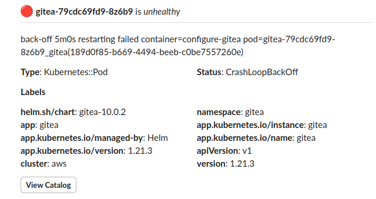
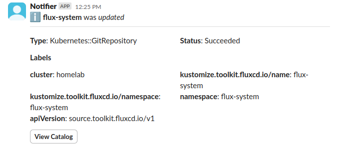

import {
  CheckHealthEnv, ConfigEventsTemplateVars, ComponentHealthEnv,
  AgentEnv, ConfigItemEnv, ComponentEnv, CanaryEnv, CheckEnv, CheckStatus,
  Uptime, Latency
} from "@site/docs/reference/notifications/_env_vars.mdx"

Configs emit events when their health changes or when they are created, modified, or removed.

## Health events

- `config.healthy`
- `config.unhealthy`
- `config.degraded`
- `config.warning`
- `config.unknown`

```yaml title="ec2-health-notification.yaml"
apiVersion: mission-control.flanksource.com/v1
kind: Notification
metadata:
  name: ec2-instance-health-alerts
  namespace: default
spec:
  events:
    - config.unhealthy
    - config.warning
  filter: config.type == 'AWS::EC2::Instance'
  to:
    email: alerts@acme.com
```




### Default Template

The default notification template for health events is:

#### Title

```
{{ if ne channel "slack"}}{{.config.type}} {{.config.name}} is {{.config.health}}{{end}}
```

#### Template

```txt file=<rootDir>/modules/mission-control/notification/templates/config.health

```

## State events

- `config.created`
- `config.updated`
- `config.changed`
- `config.deleted`

```yaml title="ec2-instance-updates.yaml"
apiVersion: mission-control.flanksource.com/v1
kind: Notification
metadata:
  name: ec2-instance-changes
  namespace: default
spec:
  events:
    - config.created
    - config.updated
    - config.changed
    - config.deleted
  filter: config.type == 'AWS::EC2::Instance'
  to:
    email: alerts@acme.com
```



### Default Template

#### Title

```
{{ if ne channel "slack"}}{{.config.type}} {{.config.name}} was {{.new_state}}{{end}}
```

#### Template

```txt file=<rootDir>/modules/mission-control/notification/templates/config.db.update

```

## Template Variables

<ConfigEventsTemplateVars />

### Config Item
<ConfigItemEnv />

### Agent
<AgentEnv />
