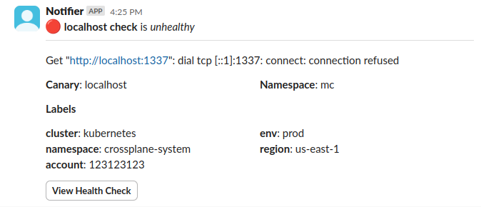

import {
  CheckHealthEnv, ConfigEventsTemplateVars, ComponentHealthEnv,
  AgentEnv, ConfigItemEnv, ComponentEnv, CanaryEnv, CheckEnv, CheckStatus,
  Uptime, Latency
} from "@site/docs/reference/notifications/_env_vars.mdx"

Health checks emit 2 events

- `check.passed`
- `check.failed`

```yaml title="notification.yaml"
apiVersion: mission-control.flanksource.com/v1
kind: Notification
metadata:
  name: api-http-fail-alert
  namespace: default
spec:
  events:
    - check.failed
  filter: check.type == 'http'
  title: API HTTP Check {{.check.name}} failing
  body: |
    ## Check Failed
    Error: {{.status.error}}
    Failed at {{.status.created_at}}
  to:
    email: alerts@acme.com
```



## Default Templates

### check.passed

#### Title

```
{{ if ne channel "slack"}}Check {{.check.name}} has passed{{end}}
```

#### Template

Default content is generated from the notification payload in `modules/mission-control/notification/message.go`.

### check.failed

#### Title

```
{{ if ne channel "slack"}}Check {{.check.name}} has failed{{end}}
```

#### Template

Default content is generated from the notification payload in `modules/mission-control/notification/message.go`.

## Template Variables

<CheckHealthEnv />

### Agent
<AgentEnv />

### Canary
<CanaryEnv />

### Check
<CheckEnv />

### CheckStatus
<CheckStatus />

### Uptime
<Uptime />

### Latency
<Latency />
