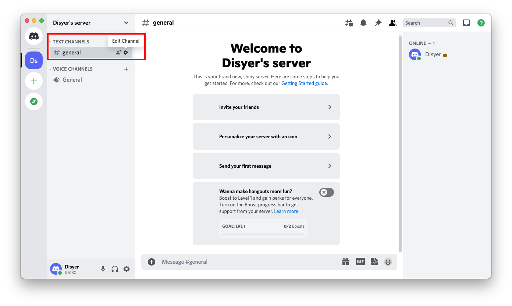
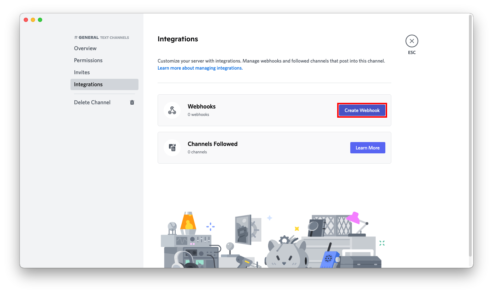

# Discord

:::note URL Format
    discord://__`token`__@__`webhookid`__
:::

import { FaGear } from "react-icons/fa6";
import Fields from '@site/src/components/Fields';

<Fields rows={[
    {
        field: "token",
        required: true,
        description: "Discord API application token",
        scheme: "string",
    },
    {
        field: "webhookID",
        required: true,
        description: "Discord webhook ID",
        scheme: "string",
    },
    {
        field: "avatar",
        description: "Override the webhook default avatar with specified URL",
        aliases: ["avatarurl"],
        scheme: "string",
    },
    {
        field: "color",
        description: "The color of the left border for plain messages",
        default: "0x50D9ff",
        scheme: "string",
    },
    {
        field: "colorDebug",
        description: "The color of the left border for debug messages",
        default: "0x7b00ab",
        scheme: "string",
    },
    {
        field: "colorError",
        description: "The color of the left border for error messages",
        default: "0xd60510",
        scheme: "string",
    },
    {
        field: "colorInfo",
        description: "The color of the left border for info messages",
        default: "0x2488ff",
        scheme: "string",
    },
    {
        field: "colorWarn",
        description: "The color of the left border for warning messages",
        default: "0xffc441",
        scheme: "string",
    },
    {
        field: "json",
        description: "Whether to send the whole message as the JSON payload instead of using it as the 'content' field",
        default: "No",
        scheme: "bool",
    },
    {
        field: "splitLines",
        description: "Whether to send each line as a separate embedded item",
        default: "Yes",
        scheme: "bool",
    },
    {
        field: "username",
        description: "Override the webhook default username",
        scheme: "string",
    },
]} />


## Getting a

1. Click on the <FaGear /> next to your channel name


2. Click on **Integrations**


3. Click on **Create Webhook**


4. Set the name, channel and icon and then click on  **Copy Webhook URL**


5. Click on **Save Changes**


6. Copy the `webhookId` and `token` fields from the URL
    ```
    https://discord.com/api/webhooks/693853386302554172/W3dE2OZz4C13_4z_uHfDOoC7BqTW288s-z1ykqI0iJnY_HjRqMGO8Sc7YDqvf_KVKjhJ
                                    └────────────────┘ └──────────────────────────────────────────────────────────────────┘
                                        webhook id                                    token

    discord://W3dE2OZz4C13_4z_uHfDOoC7BqTW288s-z1ykqI0iJnY_HjRqMGO8Sc7YDqvf_KVKjhJ@693853386302554172
            └──────────────────────────────────────────────────────────────────┘ └────────────────┘
                                            token                                    webhook id
    ```
