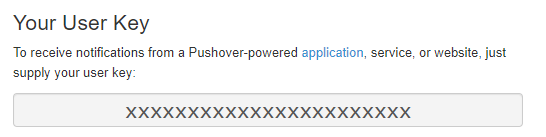
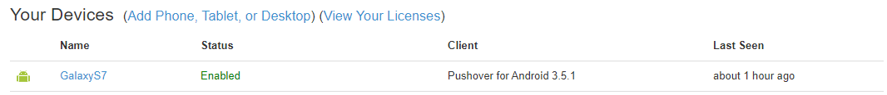
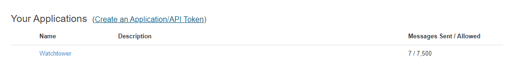
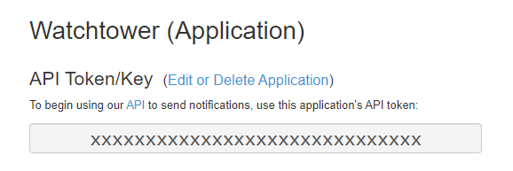

# Pushover

:::info URL Format
    pushover://shoutrrr:__`apiToken`__@__`userKey`__/?devices=__`device1`__[,__`device2`__, ...]&title=**Custom+Title**&priority=**1**
:::

<Fields rows={[
  {
    "field": "token",
    "description": "API Token/Key",
    "scheme": "string",
    "required": true
  },
  {
    "field": "user",
    "description": "User Key",
    "scheme": "string",
    "required": true
  },
  {
    "field": "devices",
    "scheme": "string",
        "required": true
  },
  {
    "field": "priority",
    "description": "Default: `0`",
    "scheme": "int between `-1` and `1`"
  },
  {
    "field": "title",
    "scheme": "string"
  }
]}/>

## Getting the keys from Pushover

1. Navigate to the [Pushover dashboard](https://pushover.net/) to get your __`userKey`__ in the top right.

2. The `Name` column of the device list is what is used to refer to your devices (__`device1`__ etc.)

3. Click on an application at the bottom of the page

4. The __`apiToken`__ is displayed at the top of the application page.

See [Pushover API documentation](https://pushover.net/api#messages) for more information.
