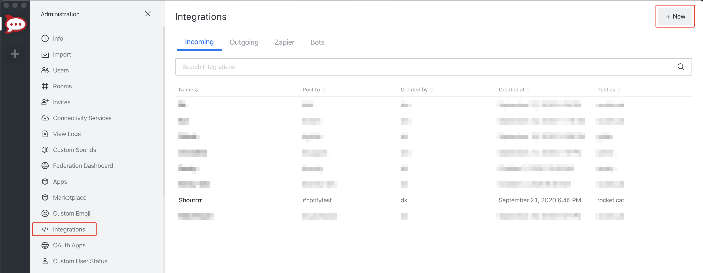
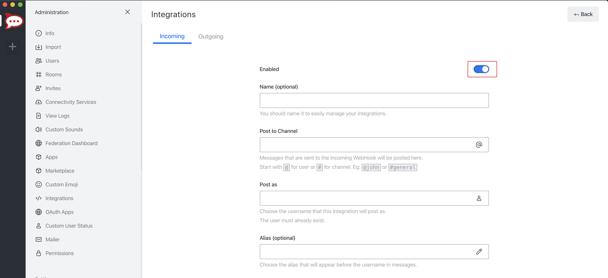
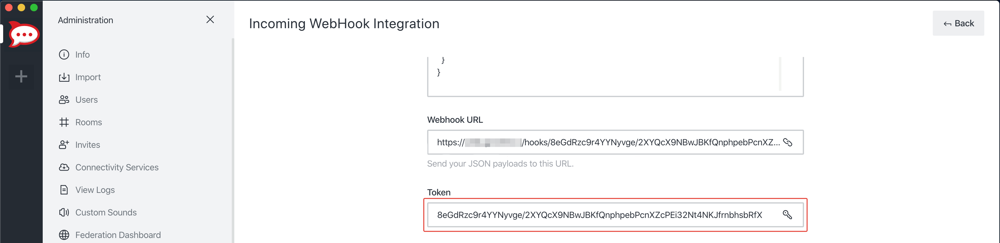

# Rocket.chat

:::note URL Format
    rocketchat://[__`username`__@]__`rocketchat-host`__/__`token`__[/__`channel`&#124;`@recipient`__]*
:::


## Creating a Webhook in Rocket.chat

1. Open up the chat Administration by clicking on *Administration* menu


2. Open *Integrations* and then click *New*


3. Fill in the information for the webhook and click *Save*. Please don't forget to Enable your integration.


5. If you did everything correctly, Rocket.chat will give you the *URL* and *Token* to your newly created webhook.


6. Format the service URL
    ```
    rocketchat://your-domain.com/8eGdRzc9r4YYNyvge/2XYQcX9NBwJBKfQnphpebPcnXZcPEi32Nt4NKJfrnbhsbRfX
                                └────────────────────────────────────────────────────────────────┘
                                                            token
    ```


See [official guide](https://docs.rocket.chat/guides/administrator-guides/integrations).
