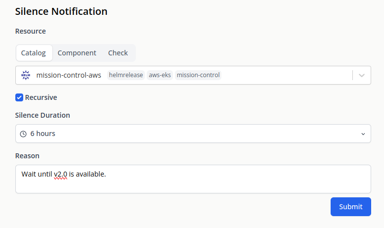

A silence is a way to temporarily suppress notifications. Each silence has:

- A set duration - like an expiration timer
- A scope - it can be applied to either:
  - Individual resources (a specific catalog, health check, or component)
  - Multiple matching resources using filters

:::note
Notifications that aren't sent due to silence are still visible in the notification history for auditing purposes.
:::

## Use cases

- Planned maintenance or deployments. Eg: You can silence a namespace or a helm release and automatically silence notifications from all their children.
- Non-critical resources: Notifications from resources that routinely trigger alerts but are expected and harmless can be silenced.
- Known issues: If there's a known issue that can't be immediately resolved (e.g., due to dependencies or resource constraints), you might silence related alerts until a fix can be implemented.

## Add Silence

Silences can be added from the notification page. Alternatively, if you're using the default slack notification templates, you get a silence button
on each notification.

### Filters

A silence can optionally contain a filter. A filter is a cel-expression that results in a boolean value. 
If a filter return true, the notification is silenced.

Example: `check.type == 'http'` filter silences only HTTP check related notifications.

#### Template variables

- [CheckEvents](/reference/notifications/template_vars/checks)
- [ConfigEvents](/reference/notifications/template_vars/config)
- [ComponentEvents](/reference/notifications/template_vars/components)

## Recursive mode

When a silence is recursively applied, it applies to its all children. 
So silencing a namespace would silence all deployments, statefulsets, pods, etc in that namespace. 
