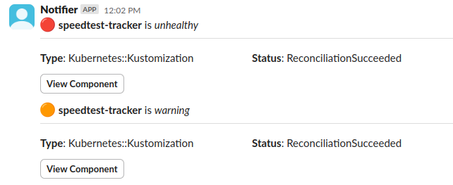

import { ComponentHealthEnv, AgentEnv, ComponentEnv } from "../../reference/notifications/_env_vars.mdx"

Components updates emit the following events when its health changes

- `component.healthy`
- `component.unhealthy`
- `component.warning`
- `component.unknown`

```yaml title="unhelthy-component-notification.yaml"
apiVersion: mission-control.flanksource.com/v1
kind: Notification
metadata:
  name: web-api-component-alert
  namespace: default
spec:
  events:
    - component.unhealthy
  filter: component.type == 'WebAPI'
  title: WebAPI {{.component.name}} failing
  body: |
    ## Component Failed
    Status: {{.component.status}} | {{.component.status_reason}}
    Last updated: {{.component.updated_at}}
  to:
    email: alerts@acme.com
```



## Default Templates

The default notification template used is:

### Title

```
{{ if ne channel "slack"}}Component {{.component.name}} is {{.component.health}}{{end}}
```

### Template

```txt file=../../../modules/mission-control/notification/templates/component.health

```

## Template Variables

The notification title and body can be changed using the variables below:
<ComponentHealthEnv />

### Component

<ComponentEnv />

### Agent
<AgentEnv />