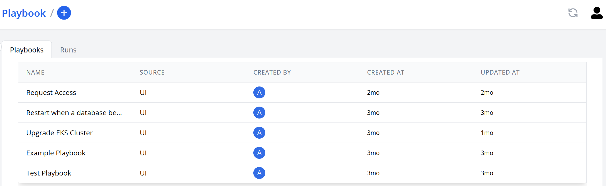
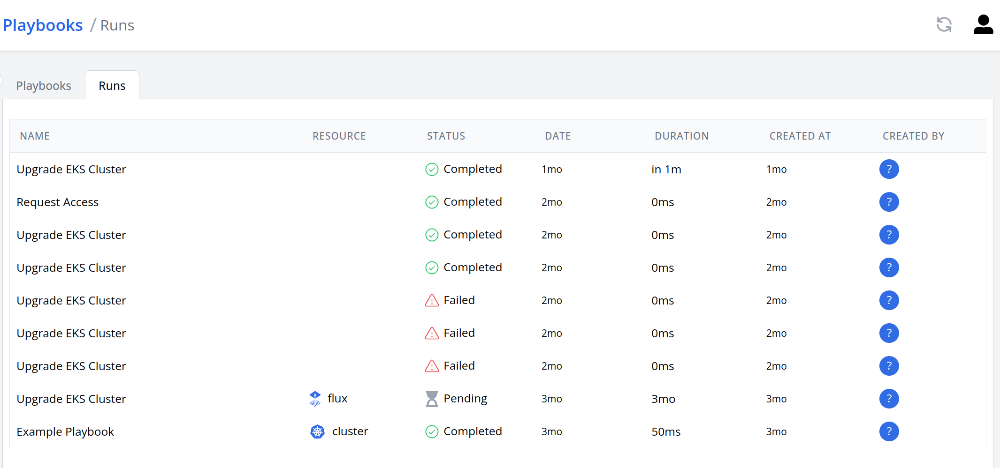
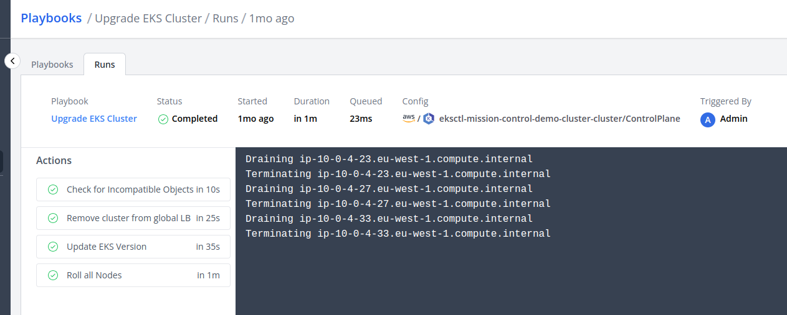

# Playbook

Playbooks are configurable automated processes that can be used to perform a variety of actions for a component or a config item.
They are defined using a YAML configuration.

```yaml title="restart-unhealthy-database.yaml"
apiVersion: mission-control.flanksource.com/v1
kind: Playbook
metadata:
  name: restart-unhealthy-database
spec:
  description: Restart when a database becomes unhealthy
  on:
    component:
      - event: unhealthy
        filter: component.type == 'database'
        labels:
          industry: e-commerce
  actions:
    - name: 'Restart kubernetes deployment'
      exec:
        script: kubectl rollout restart deployment {{.component.name}}
```


_Fig: Playbooks Page_

## Spec

| Field         | Description                                                                                                                                                 | Scheme                                | Required |
| ------------- | ----------------------------------------------------------------------------------------------------------------------------------------------------------- | ------------------------------------- | -------- |
| `description` | A short description                                                                                                                                         | `string`                              | `true`   |
| `icon`        | Icon for the playbook                                                                                                                                       | `string`                              |          |
| `on`          | Specify events to automatically trigger the Playbook. .                                                                                                     | [`[]Trigger`](#trigger)               |          |
| `runsOn`      | Specify the [runners](./runners.md) that can run this playbook. One will be chosen on random. When empty, the playbook will run on the main instance itself | `[]string`                            |          |
| `templatesOn` | Specify where the templating of the action spec should occur                                                                                                | `host`\|`agent`                       |          |
| `checks`      | Specify selectors for checks that can be run on the Playbook.                                                                                               | [`[]ResourceFilter`](#resourcefilter) |          |
| `configs`     | Specify selectors for config items that can be run on the Playbook.                                                                                         | [`[]ResourceFilter`](#resourcefilter) |          |
| `components`  | Specify selectors for component items that can be run on the Playbook.                                                                                      | [`[]ResourceFilter`](#resourcefilter) |          |
| `parameters`  | Define a set of labeled parameters for the Playbook.                                                                                                        | [`[]Parameter`](#parameter)           |          |
| `actions`     | Specify the set of actions to run.                                                                                                                          | [`[]Action`](#action)                 | `true`   |
| `approval`    | Specify who can approve runs on this playbook.                                                                                                              | [`Approval`](./approval#approval)     |          |

### Trigger

| Field       | Description                                          | Scheme                                          | Required |
| ----------- | ---------------------------------------------------- | ----------------------------------------------- | -------- |
| `canary`    | Setup trigger on canary events                       | [`EventTrigger`](../concepts/events#event-spec) |          |
| `component` | Setup trigger on health check events.                | [`EventTrigger`](../concepts/events#event-spec) |          |
| `webhook`   | Setup a webhook endpoint that triggers the playbook. | [`WebhookTrigger`](../concepts/webhook#spec)    |          |

### ResourceFilter

Filters can define what resources (checks, configs or components) are permitted be run on the Playbook.

| Field  | Description                | Scheme              | Required |
| ------ | -------------------------- | ------------------- | -------- |
| `type` | Specify type of component. | `string`            |          |
| `tags` | Specify tags of component. | `map[string]string` |          |

### Parameter

Playbook parameter defines a parameter that a playbook needs to run.

| Field         | Description                                                                                       | Scheme              | Required | Templatable |
| ------------- | ------------------------------------------------------------------------------------------------- | ------------------- | -------- | ----------- |
| `name`        | Name of parameter.                                                                                | `string`            | `true`   |
| `default`     | Default value of the parameter.                                                                   | `string`            |          | `true`      |
| `label`       | Label of the parameter.                                                                           | `string`            | `true`   |
| `required`    | Specify if the parameter is required                                                              | `bool`              |          |
| `icon`        | Icon of parameter. See [icons](https://github.com/flanksource/flanksource-ui/tree/main/src/icons) | `string`            |          |
| `description` | Description of the parameter.                                                                     | `string`            |          |
| `type`        | Type of parameter. _(Defaults to "text")_                                                         | `string`            |          |
| `properties`  | Properties of parameter. _Varies based on the type_                                               | `map[string]string` |          |

#### Parameter Type

| name        | Description                        | UI Component | Schema    | Properties                                              |
| ----------- | ---------------------------------- | ------------ | --------- | ------------------------------------------------------- |
| `check`     | Limits the value to a check.       | Dropdown     | `string`  | [`Check Property`](#check-parameter-properties)         |
| `checkbox`  | Boolean value toggle               | Checkbox     | `boolean` | -                                                       |
| `code`      | Text area                          | Code Editor  | `string`  | [`Code Property`](#code-parameter-properties)           |
| `component` | Limits the value to a component.   | Dropdown     | `string`  | [`Component Property`](#component-parameter-properties) |
| `config`    | Limits the value to a config item. | Dropdown     | `string`  | [`Config Property`](#config-parameter-properties)       |
| `list`      | Specify a custom list of values    | Dropdown     | `string`  | [`List Property`](#list-parameter-properties)           |
| `people`    | Limits the value to people.        | Dropdown     | `string`  | [`People Property`](#people-parameter-properties)       |
| `team`      | Limits the value to teams.         | Dropdown     | `string`  | -                                                       |
| `text`      | Text input                         | Text Input   | `string`  | [`Text Property`](#text-parameter-properties)           |

##### `check` parameter properties

| Field    | Description                        | Schema   |
| -------- | ---------------------------------- | -------- |
| `filter` | Limit the checks to the given type | `string` |

##### `component` parameter properties

| Field    | Description                            | Schema   |
| -------- | -------------------------------------- | -------- |
| `filter` | Limit the components to the given type | `string` |

##### `config` parameter properties

| Field    | Description                         | Schema   |
| -------- | ----------------------------------- | -------- |
| `filter` | Limit the configs to the given type | `string` |

##### `code` parameter properties

| Field      | Description                               | Schema   |
| ---------- | ----------------------------------------- | -------- |
| `language` | Langauge name e.g. yaml, json, toml, etc. | `string` |

##### `people` parameter properties

| Field  | Description                        | Schema  |
| ------ | ---------------------------------- | ------- |
| `role` | Limit the people to the given role | `string |

##### `text` parameter properties

| Field       | Description                                             | Schema    |
| ----------- | ------------------------------------------------------- | --------- |
| `multiline` | Whether the text field should be rendered as a text are | `boolean` |

##### `list` parameter properties

| Field     | Description        | Schema                         |
| --------- | ------------------ | ------------------------------ |
| `options` | Label of the check | [`[]ListOption`](#list-option) |

###### List Option

| Field   | Description                      | Schema   |
| ------- | -------------------------------- | -------- |
| `label` | Specify label of the list option | `string` |
| `value` | Specify value of the list option | `string` |

## Run

A run is the execution of a Playbook consisting of a sequence of actions. A run can be trigger either

- manually
- on events
- on schedule (upcoming)

For example, a playbook can be executed when a health check passes or fails.


_Fig: Playbooks Runs_

### Start Time

Every run must have a start time which is the time the run is scheduled to start. By default, the it is set to the current time.

Start time can be in future or even in the past.

## Action

Actions are the fundamental tasks executed by a playbook. A playbook can comprise multiple actions, which are executed sequentially. If any action encounters an error and fails, the execution of the playbook is halted.

| Field          | Description                                                                                                                                               | Scheme                                             | Required |
| -------------- | --------------------------------------------------------------------------------------------------------------------------------------------------------- | -------------------------------------------------- | -------- |
| `name`         | Name of action.                                                                                                                                           | `string`                                           | `true`   |
| `runsOn`       | Specify the [runners](./runners.md) that can run this action. One will be chosen on random. When empty, the playbook will run on the main instance itself | `[]string`                                         |          |
| `templatesOn`  | Specify where the templating of the action spec should occur                                                                                              | `host`\|`agent`                                    |          |
| `delay`        | A CEL expression that evaluates to a duration to delay the execution of the action. _(Sensitive to the minute.)_                                          | `string`                                           |          |
| `timeout`      | Timeout on this action.                                                                                                                                   | [`DurationString`](#duration-string)               |          |
| `exec`         | Specify exec of action.                                                                                                                                   | [`ExecAction`](../actions/exec.md)                 |          |
| `gitops`       | Specify gitops of action.                                                                                                                                 | [`GitopsAction`](../actions/gitops.md)             |          |
| `http`         | Specify http of action.                                                                                                                                   | [`HttpAction`](../actions/http.md)                 |          |
| `sql`          | Specify sql of action.                                                                                                                                    | [`SqlAction`](../actions/sql.md)                   |          |
| `pod`          | Specify pod of action.                                                                                                                                    | [`PodAction`](../actions/pod.md)                   |          |
| `notification` | Specify notification of action.                                                                                                                           | [`NotificationAction`](../actions/notification.md) |          |

:::note
Specify one or more actions; but at least one.
:::


_Fig: Playbooks Action Logs_

### Delaying actions

Actions can be delayed by a fixed duration or conditionally by a CEL expression.
It's only sensitive to the minute. i.e. if you delay by 20s it can take upto a minute to execute.

#### Templating

The CEL expression receives a environment variable that contain details about the corresponding config, check or component and the parameter (if applicable).

| Field       | Description                              | Schema                                       |
| ----------- | ---------------------------------------- | -------------------------------------------- |
| `config`    | Config passed to the playbook            | [`ConfigItem`](../references/config_item.md) |
| `component` | Component passed to the playbook         | [`Component`](../references/component.md)    |
| `check`     | Canary Check passed to the playbook      | [`Check`](../references/check.md)            |
| `params`    | User provided parameters to the playbook | `map[string]string`                          |

Valid time units are "s", "m", "h", "d", "w", "y". Eg:

- `1m15s`
- `1h5m`
- `23h`
- `1d8h`
- `1w6d8h`
- `19w0d8h`

### Conditionally running actions

Playbook actions can be conditionally run using a CEL Expression. The expressions should either return

- a boolean value _(`true` indicating run the action & skip the action otherwise)_
- or a special function among the ones listed below

#### Functions

| Function    | Description                                                 |
| ----------- | ----------------------------------------------------------- |
| `always()`  | run no matter what; even if the playbook is cancelled/fails |
| `failure()` | run if any of the previous actions failed                   |
| `skip()`    | skip running this action                                    |
| `success()` | run only if all previous actions succeeded (default)        |
| `timeout()` | run only if any of the previous actions timed out           |

#### Examples

- `if: config.deleted_at ? true: false`
- `if: always()`
