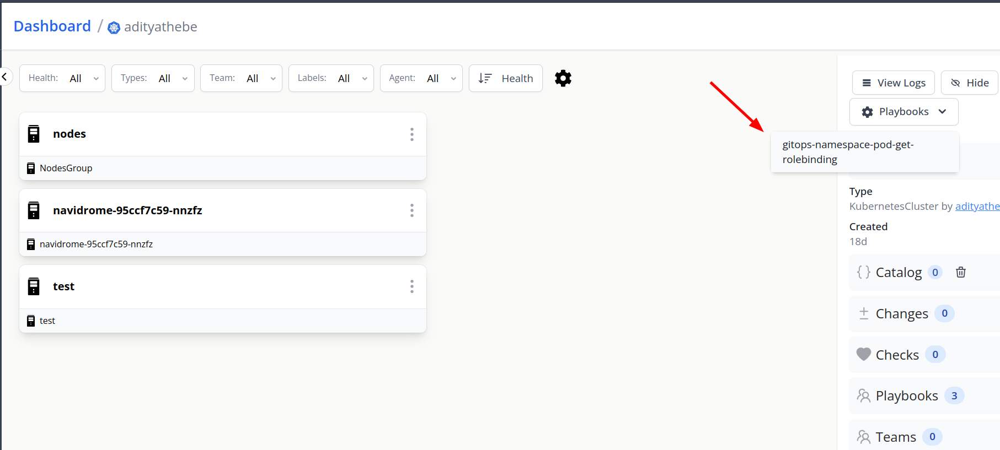
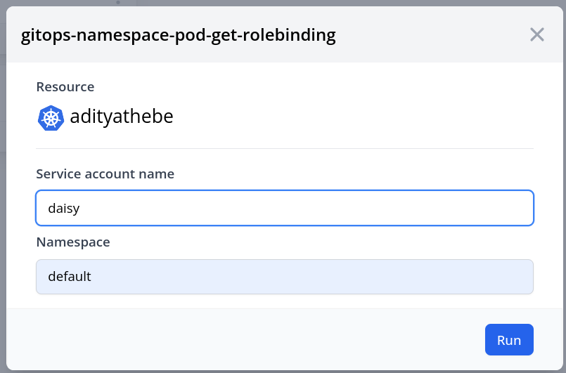
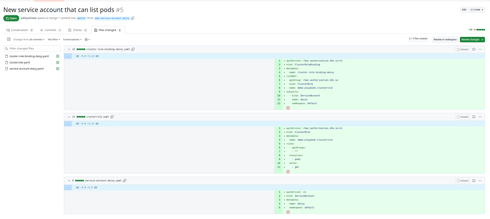

# Add cluster role binding via gitops

```yaml title="gitops-k8s-cluster-role-binding.yaml"
apiVersion: mission-control.flanksource.com/v1
kind: Playbook
metadata:
  name: gitops-namespace-pod-get-rolebinding
spec:
  parameters:
    - name: sa
      label: Service account name
    - name: namespace
      label: Namespace
  components:
    - type: KubernetesCluster
  actions:
    - name: Create new service account with cluster role bindings
      gitops:
        repo:
          url: https://github.com/adityathebe/flanksource-test
          connection: connection://github/adityathebe
          base: master
          branch: add-service-account-{{.params.sa}}
        commit:
          email: thebeaditya@gmail.com
          author: Aditya Thebe
          message: |
            Adding new service account and cluster role bindings to list pods
        pr:
          title: New service account that can list pods
        files:
          - path: 'service-account-{{.params.sa}}.yaml'
            content: |
              apiVersion: v1
              kind: ServiceAccount
              metadata:
                name: {{.params.sa}}
                namespace: {{.params.namespace}}
          - path: 'clusterrole.yaml'
            content: |
              apiVersion: rbac.authorization.k8s.io/v1
              kind: ClusterRole
              metadata:
                name: demo-playbook-clusterrole
              rules:
                - apiGroups:
                  - ""
                resources:
                  - pods
                verbs:
                  - get
          - path: 'cluster-role-binding-{{.params.sa}}.yaml'
            content: |
              apiVersion: rbac.authorization.k8s.io/v1
              kind: ClusterRoleBinding
              metadata:
                name: cluster-role-binding-{{.params.sa}}
              roleRef:
                apiGroup: rbac.authorization.k8s.io
                kind: ClusterRole
                name: demo-playbook-clusterrole
              subjects:
                - kind: ServiceAccount
                  name: {{.params.sa}}
                  namespace: {{.params.namespace}}
```

## Screenshots

### 1. Triggering playbook manully from a Cluster component


_Fig: Playbook option on the component page_



_Fig: Playbook trigger popup on the component_

### 2. Created PullRequest on Github


_Fig: Created PullRequest on Github_

### 3. Playbook action logs


_Fig: Playbook action logs_
