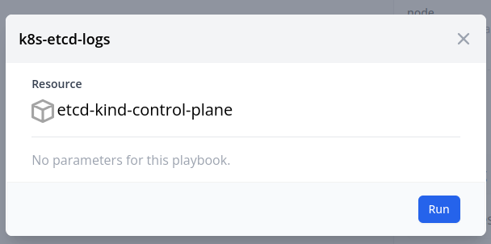
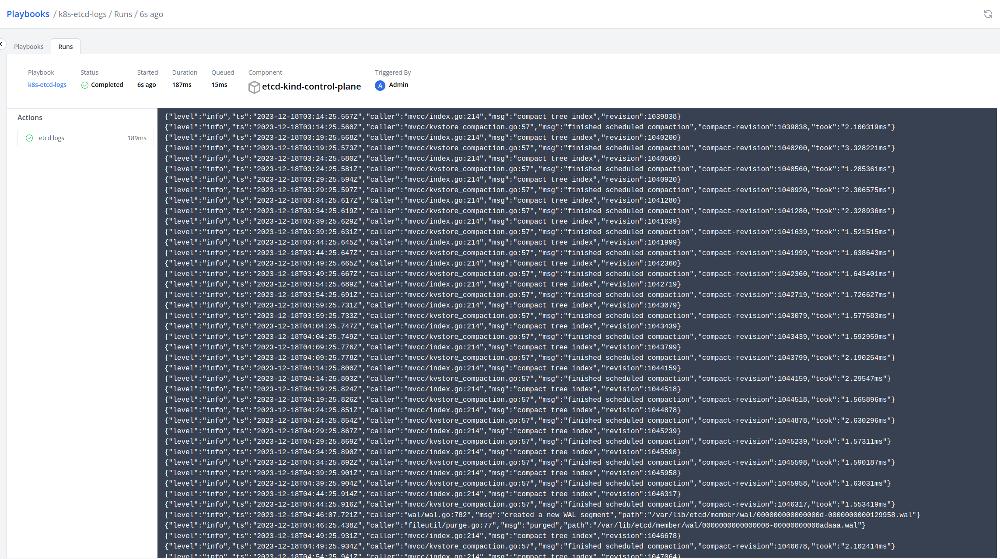

# Kubectl Logs

```yaml title="kubectl-logs.yaml"
apiVersion: mission-control.flanksource.com/v1
kind: Playbook
metadata:
  name: k8s-etcd-logs
spec:
  description: Grab the latest 100 lines of etcd logs
  components:
    - type: KubernetesPod
      tags:
        component: etcd
  actions:
    - name: 'etcd logs'
      exec:
        script: |
          mkdir -p /tmp/kubectl-logs
          kubectl logs --tail=100 -n kube-system etcd-kind-control-plane > /tmp/kubectl-logs/etcd-kind-control-plane
          cat /tmp/kubectl-logs/etcd-kind-control-plane # cat so we see them in the playbooks action logs
        artifacts:
          - path: /tmp/kubectl-logs/*
```

## Screenshots

### Triggering playbook on the component




### Playbook action logs


