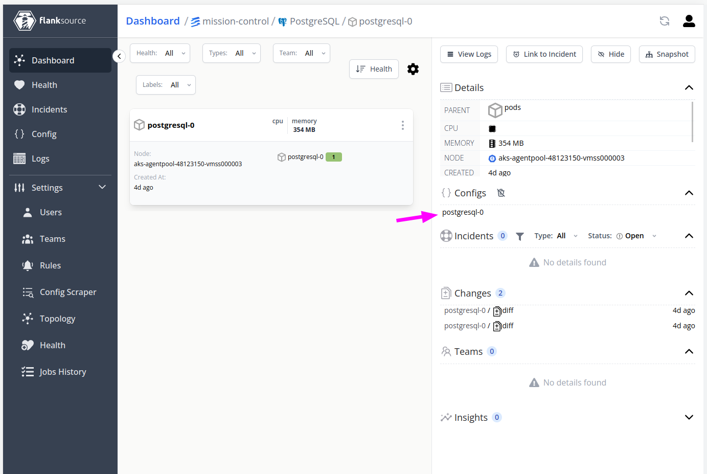

# Config

Configs can be associated to a component using the `config` property. A linked config shows up in the component page in the right hand side panel.



```yaml title="topology.yaml"
apiVersion: canaries.flanksource.com/v1
kind: Topology
metadata:
  name: test-topology-property-merge
spec:
  schedule: '@every 10m'
  components:
    - configs:
        - name: flanksource-canary-cluster
          type: EKS
```

## Config

| Field         | Description                               | Scheme              | Required |
| ------------- | ----------------------------------------- | ------------------- | -------- |
| `id`          | Specify the name of the config item.      | `[]string`          |          |
| `name`        | Specify the name of the config item.      | `string`            |          |
| `namespace`   | Specify the namespace of the config item. | `string`            |          |
| `type`        | Specify type of config item.              | `string`            |          |
| `class`       | Specify type of config item.              | `string`            |          |
| `external_id` | Specify type of config item.              | `string`            |          |
| `tags`        | Specify tags of config item.              | `map[string]string` |          |

This `Config` object is used to find config items to associate with the component. It's important to note that there can be multiple config items that can match the same `Config` object. The first match is used in that case.

To get a better result, you can provide more information in the `Config` object; example: provide name, namespace and type instead of just providing the namespace.
