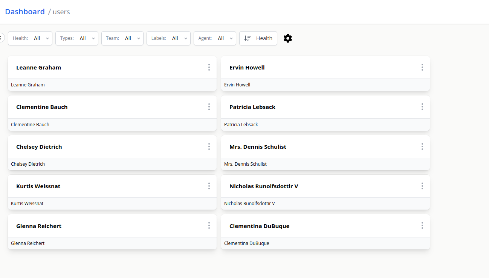

# <Icon name="http" /> HTTP

HTTP lookup queries an HTTP endpoint.

```yaml title="users-topology.yaml"
apiVersion: canaries.flanksource.com/v1
kind: Topology
metadata:
  name: users
  namespace: default
spec:
  schedule: '@every 30s'
  components:
    - name: Users
      type: Employees
      icon: person
      // highlight-start
      lookup:
        http:
          - url: https://jsonplaceholder.typicode.com/users
            display:
              expr: |
                dyn(json).map(c, {
                  'name': c.name,
                  'type': 'person',
                }).toJSON()
      // highlight-end
```

This topology will create a root **"users"** component with all the users returned by the HTTP endpoint as its child components.



| Field          | Description                                                                                                   | Scheme                                                 | Required |
| -------------- | ------------------------------------------------------------------------------------------------------------- | ------------------------------------------------------ | -------- |
| **Connection** |                                                                                                               |                                                        |          |
| `connection`   | Path of existing connection e.g. `connection://sftp/instance`/ Mutually exclusive with `username`, `password` | <CommonLink to="connection" >_Connection_</CommonLink> |          |
| `username`     | Mutually exclusive with `connection`                                                                          | [_EnvVar_](../../concepts/authentication/#envvar)      |          |
| `password`     | Mutually exclusive with `connection`                                                                          | [_EnvVar_](../../concepts/authentication/#envvar)      |          |
| **`url`**      | HTTP URL, if a URL is specified on both the connection and check, the URL on the check takes precedence.      | _string_                                               | Yes      |
| `ntlm`         | When true, will do authentication using NTLM v1 protocol                                                      | _bool_                                                 |          |
| `ntlmv2`       | When true, will do authentication using NTLM v2 protocol                                                      | _bool_                                                 |          |
